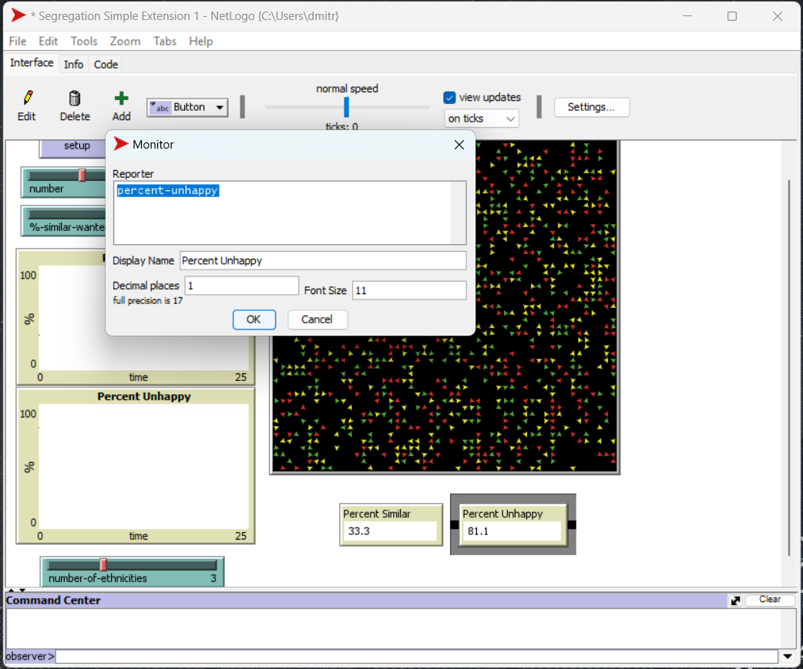
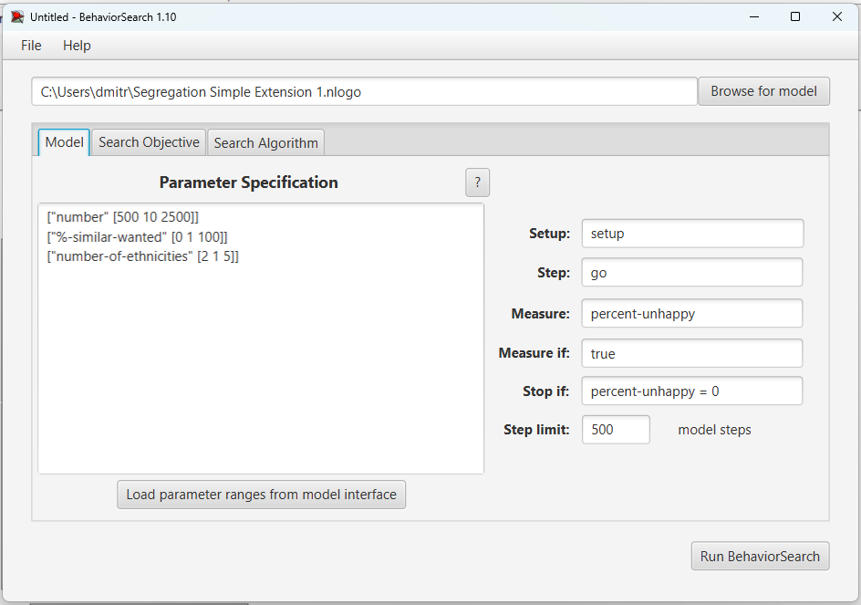
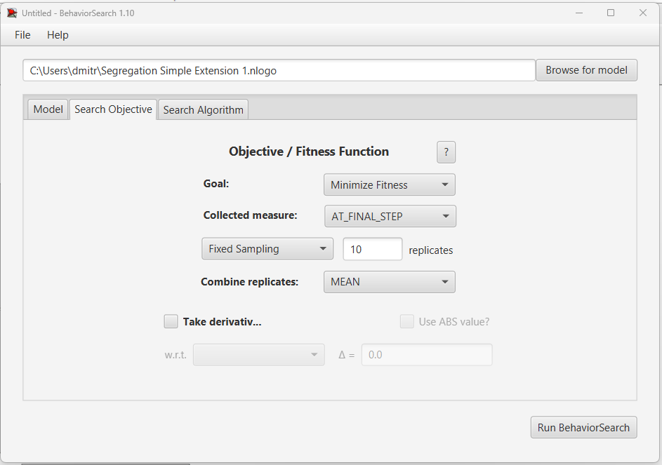
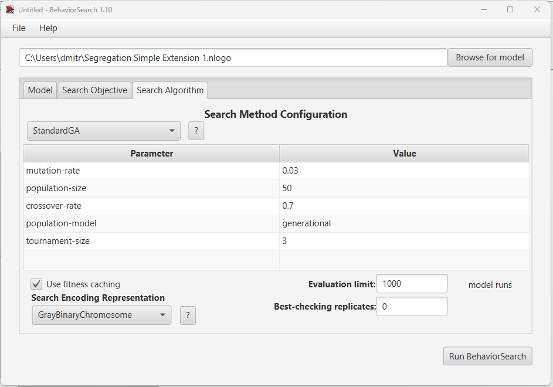
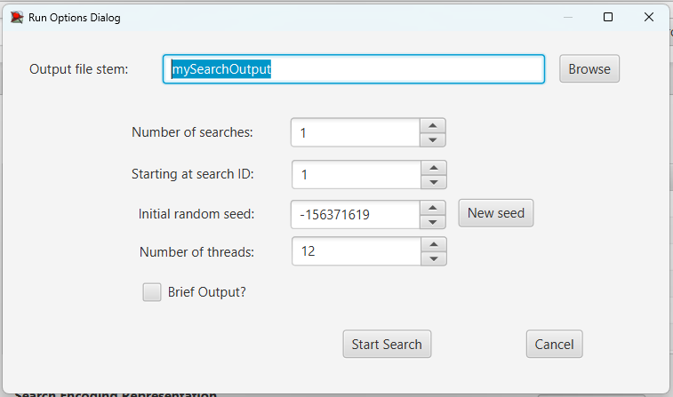
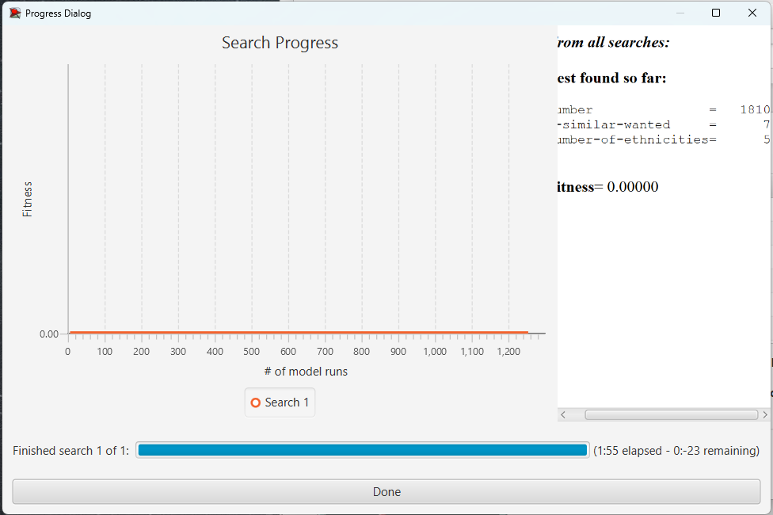
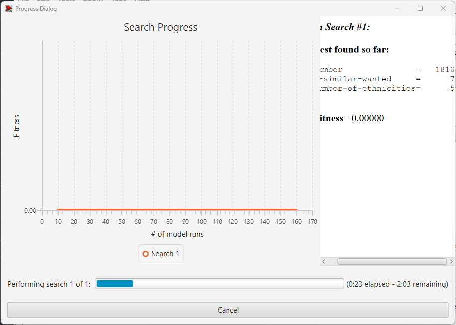
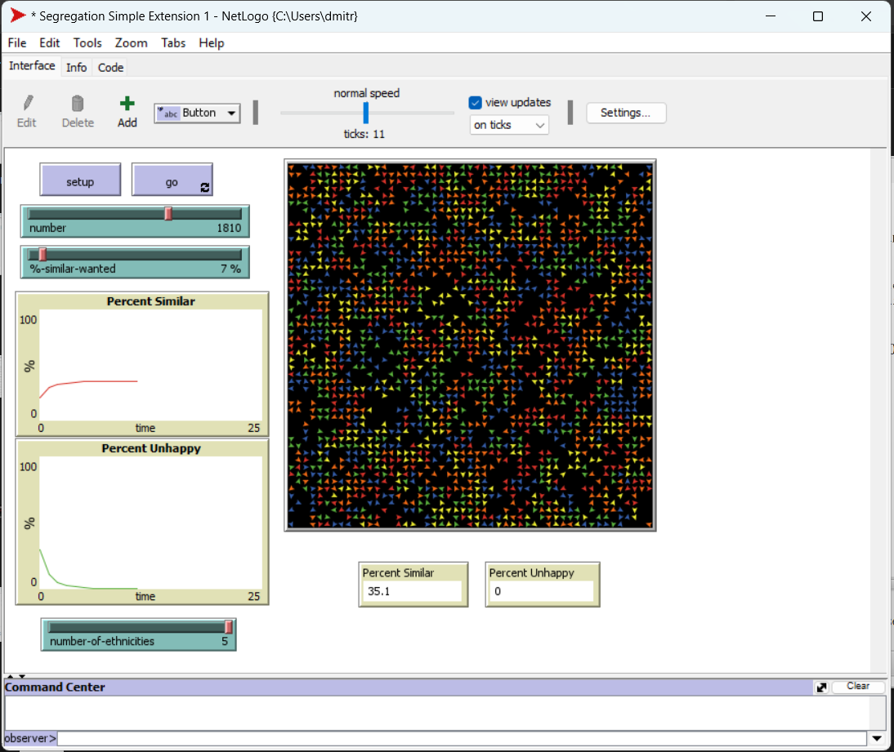

## Комп'ютерні системи імітаційного моделювання
## СПм-22-3, **Зайцев Дмитро Ярославович**
### Лабораторна робота №**3**. Використання засобів обчислювального інтелекту для оптимізації імітаційних моделей

 

### Варіант 8, модель у середовищі NetLogo:
[Segregation Simple Extension 1](http://www.netlogoweb.org/launch#http://www.netlogoweb.org/assets/modelslib/IABM%20Textbook/chapter%203/Segregation%20Extensions/Segregation%20Simple%20Extension%201.nlogo)
 

### Вербальний опис моделі:
Цей проект моделює поведінку черепах різних етнічних груп у міфічному ставку. Всі черепахи ладнають між собою. Але кожна черепаха хоче переконатися, що вона живе біля когось «свого». Симуляція показує, як ці індивідуальні вподобання впливають на переміщення в ставку.

### Керуючі параметри:
- **number** Визначає кількість агентів у середовищі моделювання, тобто, в даній моделі, кількість черепашок у ставку.
- **%-similar-wanted**. Контролює відсоток одноколірних черепах, яких кожна черепаха хоче мати серед своїх сусідів. Наприклад, якщо повзунок встановлено на 30, кожна зелена черепаха хоче, щоб принаймні 30% її сусідів були зеленими черепахами.
- **number-of-ethnicities** Повзунок контролює кількість різних типів черепах, кожен тип різного кольору.

### Внутрішні параметри:
#### Глобальні
- **percent-similar**. Середній відсоток скільки сусідів черепахи такого ж кольору, як і кожна черепаха.
- **percent-unhappy**. Скільки відсотків черепах незадоволені.
- **colors**. Список кольорів, які використовуються.
#### Для кожного агента
- **happy**. Для кожної черепахи вказує, чи принаймні ***%-similar-wanted*** відсоток сусідів цієї черепахи такого ж кольору, як і ця черепаха.
- **similar-nearby**. Зберігає як багато черепах того ж кольору поряд.
- **total-nearby**. Зберігає скільки всього черепах поряд.

### Показники роботи системи:
- Середній відсоток для кожної черепахи, який означає скільки сусідів у черепахи такого ж кольору. Змінюється кожного такту.
- Відсоток незадоволених черепах (не ***happy***).

### Налаштування середовища BehaviorSearch:

**Обрана модель**:
<pre>
C:\Users\dmitr\Segregation Simple Extension 1.nlogo
</pre>
**Параметри моделі** (вкладка Model):  
*Параметри та їх модливі діапазони були **автоматично** вилучені середовищем BehaviorSearch із вибраної імітаційної моделі, для цього є кнопка «Завантажити діапазони параметрів із інтерфейсу моделі»*:
<pre>
["number" [500 10 2500]]
["%-similar-wanted" [0 1 100]]
["number-of-ethnicities" [2 1 5]]
</pre>
Використовувана **міра**:  
Для фітнес-функції *(вона ж функція пристосованості або цільова функція)* було обрано **percent-unhappy**, змінна взята з графіка аналізованої імітаційної моделі в середовищі NetLogo, для моделі ідеальним(фінальним) значенням вважається **0**  
  
та вказано у параметрі "**Measure**":
<pre>
100 - percent-unhappy
</pre>
Модель враховує відсоток незадоволених черепах, який зі стартом моделі має найбільше значення, але з часом симуляції поступово зменшується аж поки не дійде до 0. Лише при значенні параметру **percent-unhappy = 0** симуляція закінчується.
Встановлено ліміт 500 тактів задля економії часу та машинних ресурсів.
*Параметр "**Mesure if**" зі значення true, по суті, і означає, що враховуватимуться всі такти симуляції, а чи не частина їх.
Параметри "**Setup**" та "**Go**" вказують відповідні процедури ініціалізації та запуску в логіці моделі (зазвичай вони так і називаються). BehaviorSearch в процесі роботи, по суті, замість користувача запускає ці процедури.*  
Параметр зупинки за умовою ("**Stop if**") налаштовуємо таким чином, щоб при досягненні нульового відсотку незадоволеності пошук зупиняється.  
Загальний вигляд вкладки налаштувань параметрів моделі:  

**Налаштування цільової функції** (вкладка Search Objective):  
Метою підбору параметрів імітаційної моделі, що описує поведінку черепах різних етнічних груп, є **мінімізація** значення незадоволенності, що вказано у параметрі "**Goal**" зі значенням **Minimize Fitness**. Тобто необхідно визначити такі параметри налаштувань моделі, у яких в результаті значення незадоволеності серед черепах стане нульовим (тривалість симуляції (500 кроків) вказувалася на минулій вкладці). Для цього у параметрі "**Collected measure**", що визначає спосіб обліку значень обраного показника, вказано **AT_FINAL_STEP**.  
Щоб уникнути викривлення результатів через випадкові значення, що використовуються в логіці самої імітаційної моделі, **кожна симуляція повторюється по 10 разів**, результуюче значення розраховується як **середнє арифметичне**.  
Загальний вигляд вкладки налаштувань цільової функції:  

**Налаштування алгоритму пошуку** (вкладка Search Algorithm):  
*На цьому етапі було визначено модель, налаштовано її параметри (тобто вказано, які в процесі пошуку можуть змінюватися і в яких діапазонах), і обрано міру, що лежить в основі функції пристосованості, що дозволяє оцінити якість кожного перевіряємого BehaviorSearch варіантів рішення.  
У ході дослідження на лабораторній роботі використовуються два алгоритми: Випадковий пошук(**RandomSearch**) і Простий генетичний алгоритм (**StandardGA**).  
Для цих алгоритмів, що вирішують завдання пошуку такого набору параметрів імітаційної моделі, щоб задовольнити вимоги користувача (у нашому випадку – мінімізувати значення незадоволеності черепах - агентів у заданій імітаційній моделі), вказуємо що "**Evaluation limit**" = **1000** (число ітерацій пошуку, у разі ГА – це буде кількість поколінь), та "**Search Space Encoding Representation**" = **GrayBinaryChromosome** (спосіб кодування варіанта вирішення). 
Параметр "**Use fitness caching**" впливає лише на продуктивність.
Параметри, специфічні для генетичного алгоритму, використовуємо за замовчанням.*  
Загальний вид вкладки налаштувань алгоритму пошуку:  

 

### Результати використання BehaviorSearch:
Діалогове вікно запуску пошуку:  

 

Результат пошуку параметрів імітаційної моделі, використовуючи **генетичний алгоритм**:  

Результат пошуку параметрів імітаційної моделі, використовуючи **випадковий пошук**:  

 

### Перевірка знайдених значеннь параметрів для імітаційної моделі у NetLog:

Скріншот роботи імітаційної моделі при значеннях параметрів, які були отримані несподівано однакові в результаті **генетичного алгоритму** та **випадкового пошуку**:  
 

